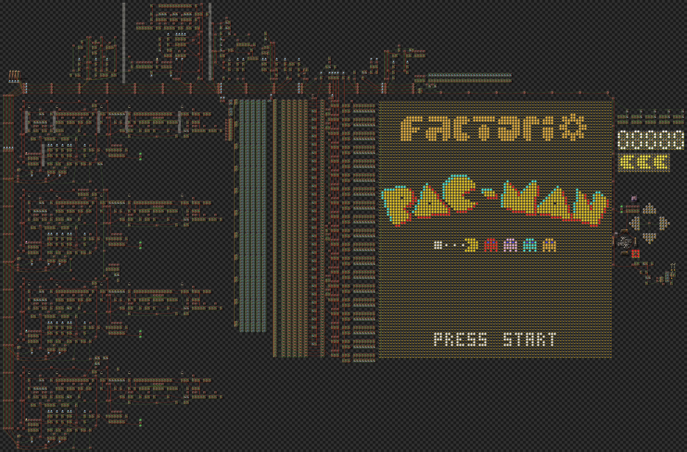

## Factorio PacMan Architecture



Highlights:

- Runs at 5x normal game speed (300 UPS), at 25 in-game FPS (12.5 in-game TPS)
- Movement done via trapping the player within carefully placed cars, then reading arrow key movement by gate opening and closing.
- Introduction song produced via [Miditorio](https://miditorio.com/)
- One level implemented, with gameplay as realistic to the original as possible, with lots of reference material provided by the [PacMan Dossier](https://pacman.holenet.info/)

### Script Usage

```bash
$ pip install -r requirements.txt
$ python main.py
```

Outputs in `/data/` consisting of `.json` (for inspection) and blueprint strings (for usage). Used to build and verify several components for the finished creation.

### Conventions

- Signals are named with their letter, and optionally with their quality as a numeric identifier (1 through 5). So T and T1 refer to the same signal, but T1 is only used when trying to differentiate from other Tn signals.
- A "Direction" refers to a value of [0, 3] matching the `Direction` enum in `main.py`
- The game is designed around being ran at 5x normal speed (300 UPS), which with the 24-tick game clock and 12-tick frame clock, gives 12.5 TPS and 25 FPS respectively.

### Bus Architecture

All components interact with a shared bus, which carries a number of specific signals. The bus consists of 4x wide, red and green wires, labeled R0 through R3 and G0 through G3:


Index | Name             | Signals
------|------------------|-----
R0    | X Position       | X
R1    | Y Position       | Y
R2    | Clock State      | F1, F2, Z1-5
R3    | PacMan           | X, Y, D1, D2, D3, V1-4, G
G0    | Sprite Data      | S1-5
G1    | Dots State       | Mixed
G2    | Energizer State  | E1-4, C, T1, T2
G3    | Game State       | S1, S2, S3, Z3, G1-4, L, L2

Implementation Notes

- R0, R1, and G0 are inputs to the screen infrastructure, and as a result they are pulsed (for exactly one tick), with the corresponding information, in the tick that it is needed.

Frame Tick Scheduling:

F2 | X Source | Y Source | Sprite Data Source
---|----------|----------|--------------------
0  | PacMan   |          |
1  | Ghost 1  |          | PacMan
2  | Ghost 2  |          | Ghost 1
3  | Ghost 3  |          | Ghost 2
4  | Ghost 4  |          | Ghost 3
5  |          |          | Ghost 4
6  |          | PacMan   |
7  |          | Ghost 1  |
8  |          | Ghost 2  |
9  |          | Ghost 3  |
10 |          | Ghost 4  |
11 |          |          |


#### Bus R0 - X Position

- X : The X position of the sprite to be drawn, using top-left convention. Does not handle out-of-bounds values. Must be multiplexed on a per-tick basis for each sprite.


#### Bus R1 - Y Position

- Y : The Y position of the sprite to be drawn, using top-left convention. Does not handle out-of-bounds values. Must be multiplexed on a per-tick basis for each sprite.


#### Bus R2 - Clock State

Contains signals that are generated by the clock (F1, F2), along with control signals used by most logic units, and to control registers. This bus MUST always be read using a buffer, applying a 1-tick delay, to keep all logic units in sync with each other.

- F1 : 24-tick clock [0, 23]
- F2 : 12-tick clock [0, 11]. Note that F2 = F1 % 12
- Z1 : Control signal, 0 = No-op, 1 = Game Reset (reset all logic, display game screen, and PacMan and Ghosts in start position)
- Z2 : Control signal, 0 = No-op, 1 = Game Off (reset all logic, display title screen, hide PacMan and Ghosts)
- Z3 : Control signal, 0 = No-op, 1 = Game Pause (pause all logic, holding the current value)
- Z4 : Control signal, 0 = No-op, 1 = Game Ghost Reset (overrides R3, hide and reset PacMan)
- Z5 : Control signal, 0 = No-op, 1 = Game PacMan Reset (overrides R3, hide and reset PacMan)


#### Bus R3 - PacMan

This bus contains most of the PacMan logic. It is a direct read from the PacMan logic registers, including adjacent logic.

- X  : The X Position of PacMan
- Y  : The Y Position of PacMan
- D1 : The direction (or -1) value emitted from the controller
- D2 : The direction (or -1) that is the current direction of movement
- D3 : The direction (or -1) that is buffered for an upcoming turn
- V1 : Ghost 1 (Red) Frightened Ticks
- V2 : Ghost 2 (Pink) Frightened Ticks
- V3 : Ghost 3 (Cyan) Frightened Ticks
- V4 : Ghost 4 (Orange) Frightened Ticks
- G  : Ghost State (0 = Chase, 1 = Scatter). Note that scared state will override this when Vn >0 for a given n


#### Bus G0 - Sprite Data

- S1, S2, S3, S4, S5 : Encoded sprite information for the current sprite to display.

Sprite Encoding:
- Each signal contains a row of five pixels, 4 bits each, MSB to LSB, Left to Right
- Each signal is stacked, S1 to S5, Top to Bottom
- Supports up to 16 colors (9 are implemented) for each pixel

```
    MSB <-------------------------------------> LSB
S1  [ ... unused ...][ 4b ][ 4b ][ 4b ][ 4b ][ 4b ]
S2  [ ... unused ...][ 4b ][ 4b ][ 4b ][ 4b ][ 4b ]
S3  [ ... unused ...][ 4b ][ 4b ][ 4b ][ 4b ][ 4b ]
S4  [ ... unused ...][ 4b ][ 4b ][ 4b ][ 4b ][ 4b ]
S5  [ ... unused ...][ 4b ][ 4b ][ 4b ][ 4b ][ 4b ]
```


#### Bus G1 - Dots State

- Mixed - Signals containing the state of the current dots in play.

Dots Encoding:
- Each signal represents a column of dots in the game, indexed using the screen index of where those signals are displayed.
- Each signal is a bitmask representing if a dot exists at that position x 3, from MSB to LSB, Left to Right.


#### Bus G2 - Energizer State

- E1 : E1 = 1 if the top-left energizer is unused
- E2 : E2 = 1 if the top-right energizer is unused
- E3 : E3 = 1 if the bottom-left energizer is unused
- E4 : E4 = 1 if the bottom-right energizer is unused
- C  : Ticks remaining on the cherry
- T1 : Number of dots eaten
- T2 : Flag value for text display, 0 = None, 1 = "READY!", 2 = "GAME OVER"
- T3 : Flag value for the in-game background, 0 = Normal, 1 = White


#### Bus G3 - Game State

Signals on the Game State bus are either constants (emitted at a constant value), or pulses (emitted for one game logic tick = 24 ticks), then captured by a register or otherwise handled by other logic. These pulses are primarily used for communicating between other logic elements (e.g. letting the ghost logic notify the game-over logic that we are in a game-over state).

- S1 : (Constant) The current score
- S2 : (Pulse) A pulse indicating a ghost was eaten. Can take values up to 1-4 to indicate multiple ghosts were eaten on the same tick.
- S3 : (Pulse) A pulse indicating a cherry was eaten.
- Z3 : (Pulse) A pulse indicating we want to emit a "pause" state to the game for a given number of ticks. This is used, e.g., when eating a ghost, to pause the game logic and display.
- G1 : (Constant) G1 = 1 if Ghost 1 (Red) is in Jail or Dead
- G2 : (Constant) G2 = 1 if Ghost 2 (Pink) is in Jail or Dead
- G3 : (Constant) G3 = 1 if Ghost 3 (Cyan) is in Jail or Dead
- G4 : (Constant) G4 = 1 if Ghost 4 (Orange) is in Jail or Dead
- L  : (Pulse) A pulse indicating PacMan has been eaten by a ghost, and the loss logic needs to be triggered
- L2 : (Constant) The number of lives remaining. L3=3, 2, or 1 indicates that many remaining


### Rendering Pipeline

Sprite Pipeline:

Sprites are encoded in a set of signals S1-S5, using packed 4-bit color. Each signal consists of a row of the sprite, holding up to five pixels. These are packed in two forms - bit packed (which gets unpacked through X translation), and quality-packed (which gets unpacked through Y translation)

```
   MSB                                              LSB
S1 [ ... 14b unused ... ][ 4b ][ 4b ][ 4b ][ 4b ][ 4b ]
S2 [ ... 14b unused ... ][ 4b ][ 4b ][ 4b ][ 4b ][ 4b ]
S3 [ ... 14b unused ... ][ 4b ][ 4b ][ 4b ][ 4b ][ 4b ]
S4 [ ... 14b unused ... ][ 4b ][ 4b ][ 4b ][ 4b ][ 4b ]
S5 [ ... 14b unused ... ][ 4b ][ 4b ][ 4b ][ 4b ][ 4b ]
```

**X-Translator**

- Unpacks the packed signals into 25x signals, indexed by screen X position
- Signals are still quality multiplexed by row (so signal Ej is offset by Y=j from E0)

**Y-Translator**

- Translates the packed signals in one tick to a row based off of the top row of the sprite
- Unpacks the signals into a single row based on quality, outputting five rows of five signals each, with arbitrary quality

**Grouping**

- Signals are then grouped by quality, into groups of 5x rows, by packing by quality. This step saves complexity in the screen registers, requiring a fifth as many registers and color multiplexers, for only a single tick delay.
- Outputs are merged with foreground and background sources, and fed into registers - two registers, one frame buffer and one next-frame buffer.

**Color Mapping**

- Translates an arbitrary number and quality of signals from 4-bit encoded color, to 24-bit color - the 24-bit color is read by the lamps.
- This supports up to 15 colors, but only 9 are implemented (including black, the background color) as that was all that was needed for the game
